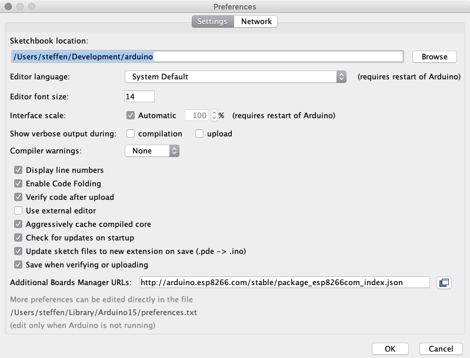

# How to ESP8266 with Arduino:

## Download and install USB Driver
Choose your board:

### NodeMCUv0.9
Download drivers here: https://github.com/nodemcu/nodemcu-devkit/tree/master/Drivers

### NodeMCUv1.0
Download drivers here: https://www.silabs.com/products/development-tools/software/usb-to-uart-bridge-vcp-drivers

## Setup Arduino IDE
We need to install additional Arduino IDE drivers and examples files to run the boards.
1. Open Arudino IDE
2. Open Preferences > Settings.
3. Update field `Additional Boards Manager URLs` to `http://arduino.esp8266.com/stable/package_esp8266com_index.json`.

4. Press `Ok`
5. Restart Arduino IDE
6. Under `Tools > Board` choose your board type `NodeMCU 0.9 (ESP-12-Module)` or `NodeMCU 1.0 (ESP-12E-Module)`
7. Choose port `/dev/cu.SLAB_USBtoUART` or respectable `/COM` port (i.e. `/COM_6`)

## Troubleshooting
Look here: https://www.mikrocontroller-elektronik.de/nodemcu-esp8266-tutorial-wlan-board-arduino-ide/
